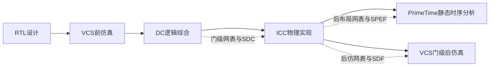

# Digital IC EDA Notes

数字IC设计与EDA工具链学习笔记，围绕RTL仿真、逻辑综合、物理实现、静态时序分析和门级后仿真整理核心概念、阶段输入输出及脚本组织方法。

本仓库侧重回答三个问题：

1. 每个EDA阶段解决什么问题；
2. 各阶段需要哪些输入，又会产生哪些输出；
3. 如何用结构清晰的脚本组织可重复执行的设计流程。

## EDA流程概览



## 文档入口

- [EDA流程学习笔记](./notes/EDA流程学习笔记.md)
- [VCS新项目RTL前仿真流程适配Prompt](./prompts/VCS新项目前仿真流程适配Prompt.md)
- [DC新项目综合流程适配Prompt](./prompts/DC新项目综合流程适配Prompt.md)

## 推荐阅读顺序

```text
VCS RTL前仿真
→ DC逻辑综合与SDC约束
→ ICC Floorplan、Power Planning、Placement、CTS和Routing
→ PrimeTime静态时序分析
→ VCS门级后仿真
```

第一次阅读建议先理解工具职责、输入输出和阶段衔接，再深入具体Tcl或Makefile命令。

## 仓库结构

```text
digital-ic-eda-notes/
├── README.md
├── notes/
│   └── EDA流程学习笔记.md
├── prompts/
│   ├── VCS新项目前仿真流程适配Prompt.md
│   └── DC新项目综合流程适配Prompt.md
└── assets/
    └── images/
```

```text
notes/      系统学习笔记
prompts/    新项目流程搭建与适配模板
assets/     文档使用的可公开图片和流程图
```

## 使用原则

- 先确认设计接口、时钟复位、工具版本和库信息，再生成或修改脚本。
- 使用相对路径组织可迁移流程，机器相关安装路径通过环境变量或配置文件提供。
- 将源码、脚本、工具生成物、正式输出和报告分开管理。
- 约束和物理参数必须结合实际设计，不机械套用模板数值。
- 无法使用目标EDA环境时，只进行静态适配，不声称流程已经运行通过。

## 内容边界

仓库仅保存个人整理的通用学习笔记和流程模板，不包含商业EDA软件、许可证、PDK、标准单元库、具体课程工程或第三方项目源码。
